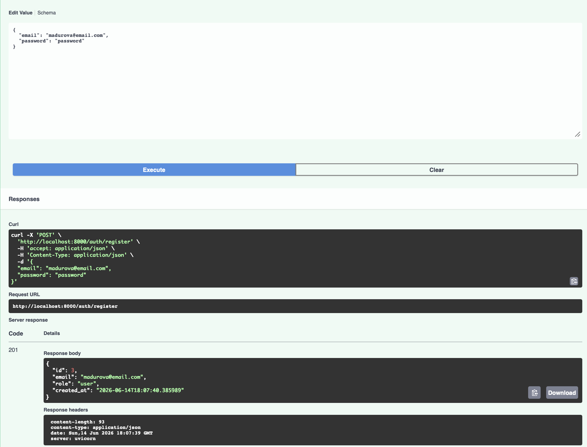
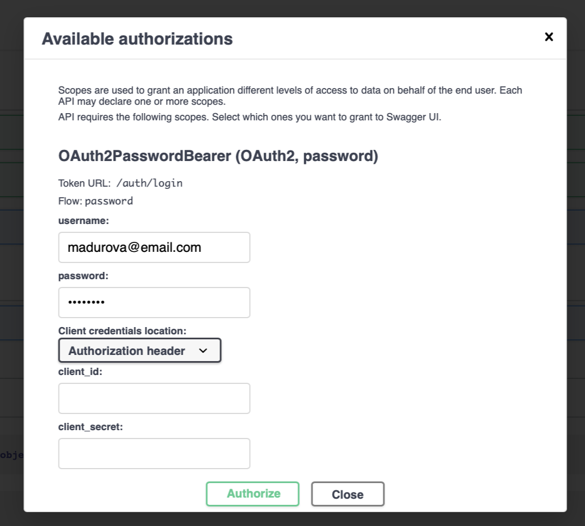
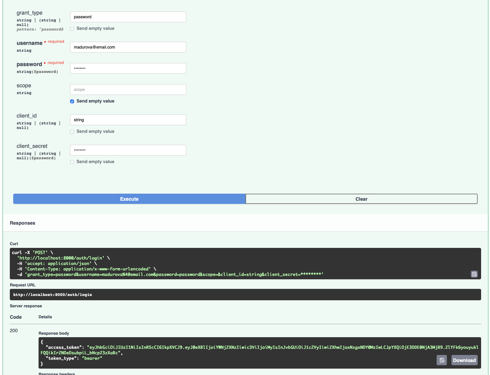
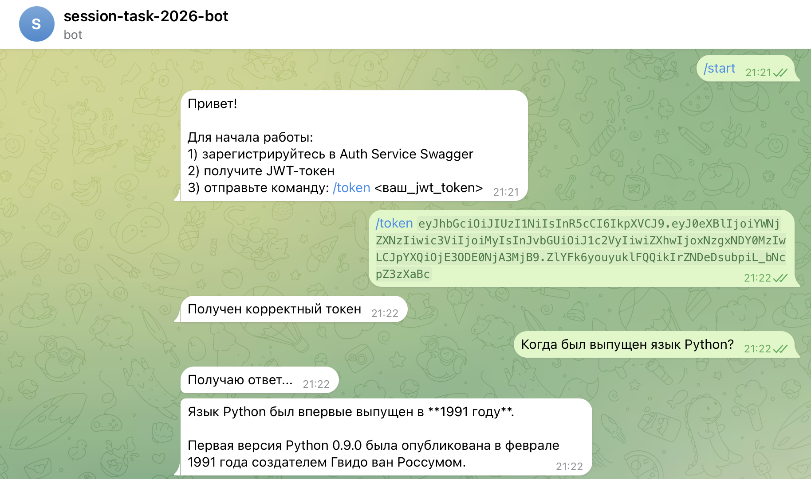
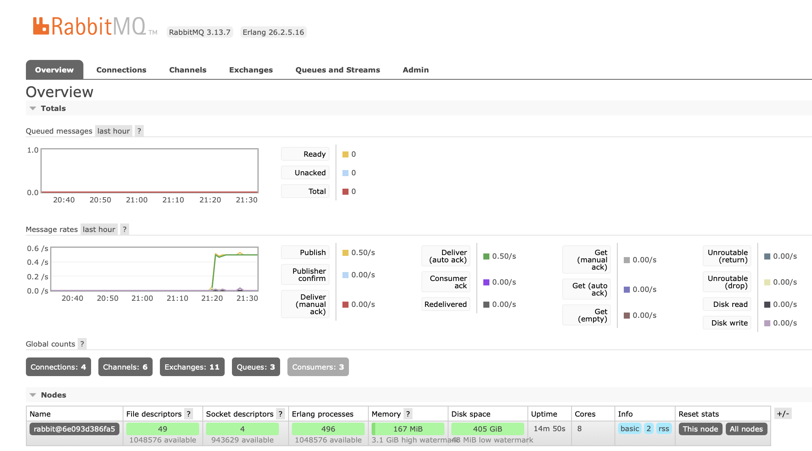
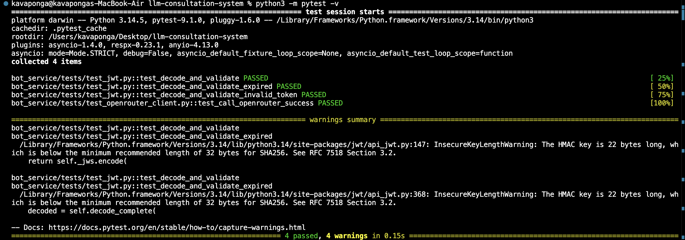

# Двухсервисная система LLM-консультаций

Telegram bot для работы с LLM

## Запуск приложения

Перед запуском приложения в файле bot_service/.env необходимо заполнить переменные `TELEGRAM_BOT_TOKEN` и `OPENROUTER_API_KEY` -- токен для telegram-бота и для OpenRouter

Приложение запускается командой `docker compose up -d --build`

Swagger API сервиса авторизации: [http://localhost:8000/docs#/](http://localhost:8000/docs#/)

Swagger API сервиса бота: [http://localhost:8001/docs#/](http://localhost:8001/docs#/)

RabbitMQ: [http://localhost:15672/#/](http://localhost:15672/#/)

## Архитектура проекта

```
├─ auth_service/              # API авторизации
│ ├─ Dockerfile
│ ├─ pyproject.toml
│ └─ app/
│   ├─ api/
│   │ ├─ deps.py              # зависимости FastAPI
│   │ ├─ router.py            # создание роутера FastAPI
│   │ └─ routes_auth.py       # эндпоинты Auth Service
│   ├─ core/
│   │ ├─ config.py            # конфигурация
│   │ ├─ exceptions.py        # кастомные исключения
│   │ └─ security.py          # создание и валидация JWT
│   ├─ db/
│   │ ├─ base.py              # базовый класс SQLAlchemy
│   │ ├─ models.py            # ORM-модель пользователя Auth Service
│   │ └─ session.py           # асинхронный engine SQLAlchemy
│   ├─ repositories/
│   │ └─ users.py             # репозиторий доступа к пользователям
│   ├─ schemas/
│   │ ├─ auth.py              # pydantic-схемы для регистрации и токенов
│   │ └─ user.py              # публичное представление пользователя
│   ├─ usecases/
│   │ └─ auth.py              # бизнес-логика Auth Service
│   └─ main.py
└─ bot_service/
  ├─ Dockerfile
  ├─ pyproject.toml
  ├─ app/
  │ ├─ bot/
  │ │ ├─ dispatcher.py        # создание Bot и Dispatcher
  │ │ └─ handlers.py          # telegram-команды
  │ ├─ core/
  │ │ ├─ config.py            # конфигурация
  │ │ └─ jwt.py               # валидация JWT
  │ ├─ infra/
  │ │ ├─ celery_app.py        # создание Celery App
  │ │ └─ redis.py             # создание Redis
  │ ├─ services/
  │ │ └─ openrouter_client.py # запрос к OpenRouter
  │ ├─ tasks/
  │ │ └─ llm_tasks.py         # Celery Task для запроса к LLM
  │ └─ main.py
  └─ tests/                   # тесты
    ├─ test_jwt.py
    └─ test_openrouter_client.py

```
## Работа проекта

Для работы с запущенным ботом нужно получить JWT-токен по API, предоставить его боту и начать работу

Регистрация через эндпойнт регистрации 


Авторизация в Swagger


Получение токена через эндпойнт /auth/login


Работа с ботом с полученным JWT


RabbitMQ


## Тесты

Тесты запускаются командой `python3 -m pytest -v`

